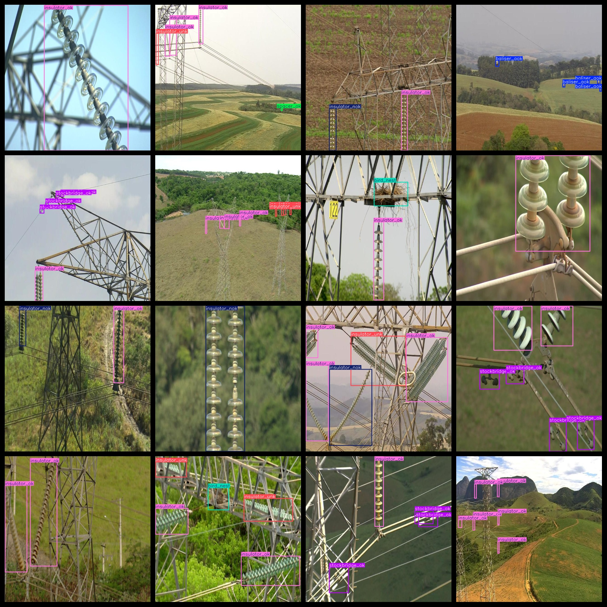
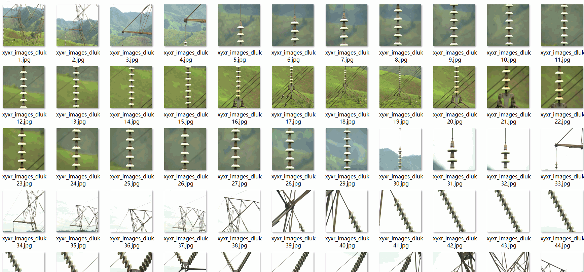

# UAV Aerial Transmission Line Road Inspection Dataset 5977 imagesVOC+YOLO format

This dataset contains 5977 images of power lines inspected by drones. The format is VOC+YOLO.

Dataset format: Pascal VOC format + YOLO format (the txt file does not contain the split path, it only contains jpg images and corresponding VOC format xml files and yolo format txt files)

Total number of images: 5977

Number of xml files: 5977

Number of txt files: 5977

Number of categories: 10

The Github repository is: datasets_sl

['baliser_aok', 'baliser_nok', 'baliser_ok', 'bird_nest', 'insulator_nok', 'insulator_ok', 'insulator_unk', 'spacer_nok', 'spacer_ok', 'stockbridge_ok']

"Markers Normal", "Markers Abnormal", "Markers Good", "Nest", "Insulator Abnormal", "Insulator Good", "Insulator Unknown", "Junction Abnormal", "Junction Good", "Clutch Abnormal", "Clutch Good", "Clutch Good"

Number of boxes labeled in each category:

The number of baliser_aok frames is 328.

The number of frames in the "baliser_nok" is 189.

The number of frames in the "baliser_ok" box is 132.

The number of bird nests is 319.

The number of insulator_nok boxes is 1948.

The number of insulator_ok boxes is 8347.

The number of insulator_unk instances is 1781.

Spacer Nok Frame Number = 21

The number of spacers is 1094.

The number of frames in the "Stockbridge_Ok" frame is 2929.

Total frames: 17088

Number of images per category:

baliser_aok_occupied_image_count = 244

Baliser_Nok's possession of the image count = 146

"baliser_ok" occupies the number of pictures = 94

Bird's nest has 318 pictures.

Insulator_nok's possession of image count = 1792

Insulator_ok has 4339 images.

The number of insulator_unk images is 598.

Spacer Nok occupies a total of 21 images.

The spacer_ok occupies a total of 640 images.

Stockbridge_ok has 670 images.

Image resolution: 640x640

Use the labeling tool: labelImg

Dataset Augmentation: Yes

Rules for annotation: Draw a rectangle around the category.

Important note: The dataset does not have been divided into training, validation, and testing sets.

Special Disclaimer: This dataset does not guarantee the accuracy of the trained models or weight files.

Annotation and image details are as follows:

## Images

---

Here is a pay link on Stripe (https://buy.stripe.com/3cs8yP7sY87d0vu9AB). Please contact me lonlonago@foxmail.com after funding $89, and I will send you a complete data files, thank you!

